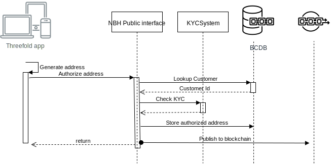

 # Integration with NBH backend systems

## App public key to customer

The Threefold app has a private/public key pair so a user can uniquely identify itself and sign requests to the public NBH API's.

At NBH side there is the notion of customers.

The big question is, **how do we link the two?**

The user can login into the onboarding UI using 3botlogin, at onboarding we can ask the customer if he already has a customerId from NBH. If so,  and approved,the user doesn't have to do KYC. 

## Customers vs addresses

At NBH side we talk about (KYC'ed) Customers. In the goldchain we have the notion of (authorized) addresses.

A User uses the Threefold app and identifies through the app. 
In the app, a goldchain wallet can be created and addresses can be created  from private keys. These addresses need to be authorized by NBH so they know which customer they belong to.

The links between NBH customers, customer threefold app id's and authorized addresses are stored in a bcdb. Let's call it the Customer BlockChain Information or "CBI" in the rest of this document.

 

[A Jumpscale schema with the required data](customer_addresses.jsschema)
 
   

### Address Authorization

If the KYC system updates the  CBI with KYC valid date, the extra call to the KYC system can be dropped.

This is the logical flow. Technically it is more secure to put the process with the key for signing the authorization transaction on a seperate container that has no entrypoint from the outside.
### Remarks
- [Wallet remarks](wallet.md)
 ## Weight Account system

 The blockchain is master and there are reports available through an explorer ran on NBH systems to update the Weight account system balances.

 This way no api's have to be exposed.

 

 The reports should contain all transactions and link them to the weight account sysstem customers
 
In order to generate the report, a daterange is needed as input.

Since the existing import functionality can not be reused due to the way it works with acquisition and tracking, an Excel format can be propsed by us.
 
## Gold acquisition

This is discussed in a [seperate topic](gold_acquisition.md).
