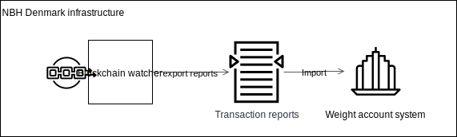

 # Integration with NBH backend systems

 ## Weight Account system

 The blockchain is master and there are reports available through an explorer ran on NBH systems to update the Weight account system balances.
 This way no api's have to be exposed.

 

 Questions:
 - What needs to be in the reports? 
 - Does the weight account system hold the link between customers and it's addresses on the chain?
 - If not all transactions should be in the report, only a date parameter is sufficient to generate the report, else, it's a daterange.
 
